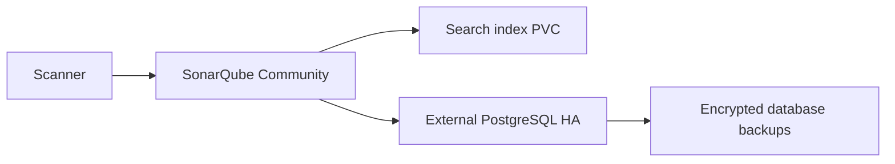

# Architecture

One SonarQube Community application uses a persistent data volume and an external PostgreSQL database. Pair it with the PostgreSQL HA repository; database HA does not make the Community application active-active.

## Failure domains

Community supports one application instance. Do not increase replicas or share the embedded search data directory. Multi-node SonarQube requires the supported Data Center edition and a separate licensed architecture.

Three pods on one physical host are a development topology, not independent failure domains. Use distinct workers and map placement to zones where your storage and application support it. A node-local PVC binds recovery to that node.

## Trust and data flow

Clients enter through ClusterIP services. Namespace-scoped NetworkPolicies limit workload ingress when enforced by the CNI. Operators need Kubernetes API access and admission-webhook reachability. Existing secrets are mounted or referenced at runtime; never place secret payloads in Helm values or IaC state intentionally.

## Capacity

Base and production resource/PVC requests are explicit in chart values. Benchmark your data volume, query mix and failover headroom. Leave enough capacity to recover a member while sustaining workload; do not treat requests as a sizing guarantee.
